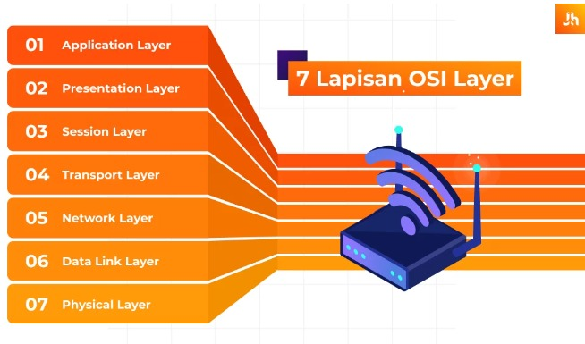

<h1>Pengenalan Internet Layers OSI</h1>
 

Nama : Agung Dwi Nugroho

Kelas : 2 D4 IT A

NRP : 3122600006

 

  

OSI adalah Open System Interconnection yang memiliki arti sebagai model referensi dari sebuah kerangka yang bersifat konseptual. Namun, sekarang sudah berkembang dan menjadi sebuah standarisasi khusus yang berkaitan dengan koneksi komputer. 

 

OSI Layers dibagi menjadi 7 layer seperti

<ul>
  <li>Application Layers</li>
  <li>Presentation Layers</li>
  <li>Session Layers</li>
  <li>Transport Layers</li>
  <li>Network Layers</li>
  <li>Data Link Layers</li>
  <li>Physical Layers</li>
</ul>

  

<h3>Penjelasan Masing Masing Layers</h3>

<ul>
  <li>
    Application Layers
    

      Application layer pada OSI adalah pusat terjadinya suatu interaksi antara user dengan aplikasi yang bekerja menggunakan fungsionalitas sebuah jaringan. Lapisan ini menjadi layer paling atas dari model OSI. Contoh beberapa protokol yang ada di layer application pada OSI adalah HTTP, FTP, SMTP, dan lain-lain. 
    

  </li>
   
  <li>
    Presentation Layers
    

      Lapisan Presentation berfungsi untuk mengidentifikasi sintaks yang di pakai suatu host jaringan untuk berkomunikasi. Layer ini perlu memberi enkripsi serta deskripsi data yang nantinya akan di pakai dalam layer application.
       
      Pada layer presentation, data akan ter-enkripsi dan dekripsi otomatis melalui sistem. Beberapa protokol yang berada pada layer ini adalah MIME, TLS, SSL, dan lainnya. 
    

  </li>
   
  <li>
    Session Layers
    

      Layer session memiliki fungsi untuk mengendalikan dialog maupun melakukan pengelolaan terhadap koneksi suatu komputer. Bahkan layer ini juga bisa melakukan pemutusan koneksi internet pada suatu komputer. Contoh protokol yang berada di layer ini adalah NFS, RTP, SMB, dan lainnya. 
    

  </li>
   
  <li>
    Transport Layers
    

      Mengapa di sebut transport layer? Sebab lapisan ini memiliki peran untuk menyalurkan bit. Ada beberapa fungsi spesifik dari layer ini, yaitu:
      <ul>
        <li>Memecahkan data yang akan dimasukkan ke dalam beberapa paket data</li>
        <li>Melakukan transmisi data mulai dari session sampai ke network layer</li>
        <li>Setiap paket yang ada akan diberikan penomoran oleh layer ini, sehingga mudah untuk menyusun ulang</li>
        <li>Melakukan looping terhadap proses transmisi yang ada dalam paket data yang hilang</li>
      </ul>
      Dengan layer ini, data bisa disalurkan dari server menuju ke pengguna tanpa adanya gangguan
    

  </li>
   
  <li>
    Network Layers
    

      Layer network pada OSI ini bertugas untuk mendefinisikan alamat IP sehingga setiap komputer dapat saling terkoneksi dalam satu jaringan. Fungsi lainnya adalah melaksanakan proses routing dan membuat header untuk setiap paket data yang ada
    

  </li>
   
  <li>
    Data Link Layers
    

      Fungsi utama dari data link layer adalah untuk memeriksa bila terjadi kesalahan dalam menyalurkan transmisi terhadap bit data. Dimana kesalahan tersebut kemungkinan besar terjadi di layer pertama. Pada layer ini juga terjadi koreksi kesalahan, pengalamatan hardware pada MAC address, dan flow control.
    

  </li>
   
  <li>
    Physical Layers
    

     Layer physical pada OSI adalah lapisan yang berfungsi sebagai transmisi terhadap bit data. Jenis sinyal yang di pakai pun tidak sembarangan, sehingga memungkinkan penerimaan sinyal dengan baik. 
     
    Jenis sinyalnya pun harus di dukung media fisik, misal kabel, infrared, cahaya biasa, frekuensi radio, dan tegangan listrik. Setelah layer ini menyelesaikan tugasnya, maka akan diteruskan ke layer kedua.
    

  </li>
  
</ul>
