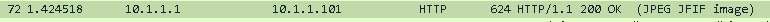
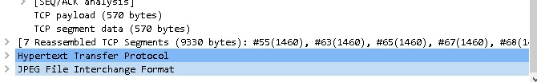
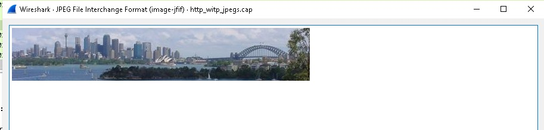

<h1>Analisis HTTP CTF Image in Packet</h1>
 

Nama : Agung Dwi Nugroho

Kelas : 2 D4 IT A

NRP : 3122600006

Dengan menggunakan Wireshark kita dapat mengehatui traffic internet dan data packet yang didistribusikan. Berikut merupakan cara mencari packet jpeg pada traffic di Wireshark

<ul>
  <li>
    <h4>Cari data yang yang mengandung jpeg</h4>
    
    
biasanya file jpeg itu berasal dari server maka kita cari dari response dari server

  </li>
  <li>
    <h4>Cari format jpeg</h4>
    
    
klik kanan dan show packet maka foto akan terlihat

  </li>
  <li>
    <h4>Hasil foto</h4>
    
    
berikut merupakan packet yang berhasil di encode menjadi photo berfile jpeg

  </li>
</ul>
