<h1>Analisis Wireshark HTTP, TELNET dan DNS</h1>
 

Nama : Agung Dwi Nugroho

Kelas : 2 D4 IT A

NRP : 3122600006

 

<h3>HTTP</h3>
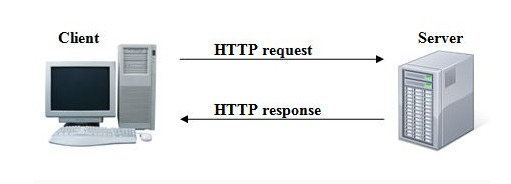
<ul>
  <li><h4>Analisis HTTP</h4>
    

      Untuk HTTP ( Hyper Text Transfer Protokol ) sendiri memiliki 2 parameter yaitu request dan response, HTTP sendiri menggunakan transport layers TCP, HTTP bekerja pada port 80.
    

  </li>
  <li><h4>Cara Kerja HTTP</h4>
    

    
1. HTTP Client mengirim permintaan informasi ke web server

    
2. HTTP server memproses permintaan client, sedangkan client menunngu proses selesai.

    
3. HTTP server memberikan informasi yang diminta. Nantinya web server tidak akan mengingat apapun koneksi yang sudah terjadi

  </li>
  <li><h4>Header di HTTP protokol</h4>
    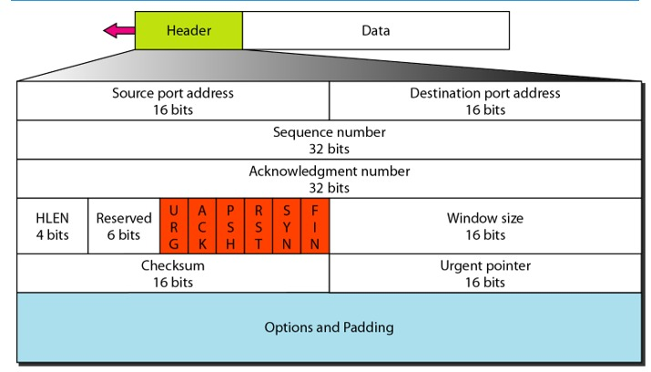
    

      Header yang dipakai HTTP merupakan dari layers TCP, berikut ini merupakan contoh header dari HTTP yang didapat dari WireShark,
    

    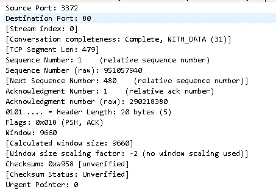
  </li>
  <li><h4>Request dan Response HTTP protokol</h4>
    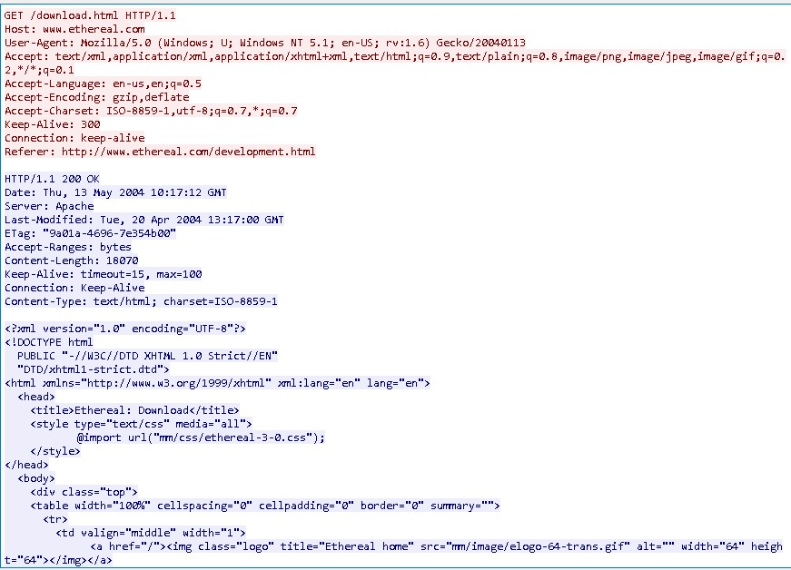
    

      untuk yang berwarna merah merupakan HTTP method yang berasal dari client, sedangkan yang berwarna biru merupakan hasil reponse yang dikempalikan ke client oleh server.
    

  </li>
</ul>
 
<h3>TELNET ( Terminal Network)</h3>
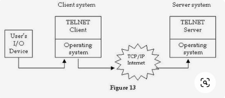

<ul>
  <li>
    <h4>Analisis TELNET</h4>
    

      Telnet adalah sebuah protokol jaringan yang digunakan untuk mengakses dan mengendalikan perangkat jarak jauh melalui koneksi berbasis teks. Dengan menggunakan protokol ini, pengguna dapat terhubung ke server atau perangkat jarak jauh, seperti server web, router, atau sistem lainnya, dan berinteraksi dengan mereka melalui antarmuka teks.
    

  </li>
  <li>
    <h4>Cara Kerja TELNET</h4>
    

    
1. <b>Inisiasi Koneksi </b>: Pengguna menjalankan perintah Telnet pada terminal atau command prompt dengan menyertakan alamat IP atau nama host dari perangkat yang ingin diakses.

    
2. <b>Permintaan Koneksi </b>: Komputer pengguna mengirimkan permintaan koneksi ke komputer tujuan melalui port Telnet (biasanya port 23). Jika koneksi berhasil, perangkat tujuan akan merespons dengan mengirimkan banner selamat datang atau pesan informasi lainnya.

    
3. <b>Interaksi </b>: Setelah koneksi terjalin, pengguna dapat memasukkan perintah-perintah teks pada terminal. Perintah-perintah ini akan dikirim ke perangkat tujuan melalui koneksi Telnet.

    
4. <b>Respon </b>: Perangkat tujuan akan memproses perintah yang diterima dan mengirimkan responnya kembali ke pengguna melalui koneksi Telnet. Respon ini bisa berupa teks atau informasi lain yang relevan dengan perintah yang diberikan.

    
5. <b>Berakhirnya Sesi </b>: Setelah pengguna selesai mengakses perangkat tujuan, mereka dapat mengakhiri sesi dengan menutup koneksi Telnet. Ini bisa dilakukan dengan mengirimkan perintah khusus atau hanya dengan menutup jendela terminal.

  </li>
  <li>
    <h4>Header di TELNET Protokol</h4>
    
    
Header yang dipakai TELNET merupakan dari layers TCP, berikut ini merupakan contoh header dari TELNET yang didapat dari WireShark,

    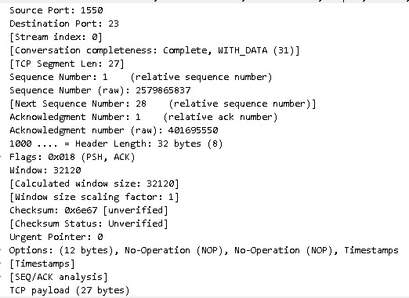
  </li>
  <li>
    <h4>Interaksi TELNET</h4>
    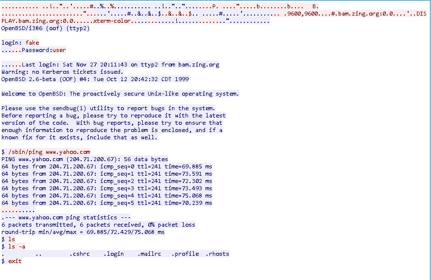
    
Untul tanda merah merupakan interaksi dari klient sedangkan biru merupakan interaksi atau response dari server, tapi kelemahan protokol telnet merupakan username sama password tidak si bcryp atau hash, hal ini cukup berbahaya.

  </li>
</ul>
 

<h3>DNS ( Domain Name System )</h3>
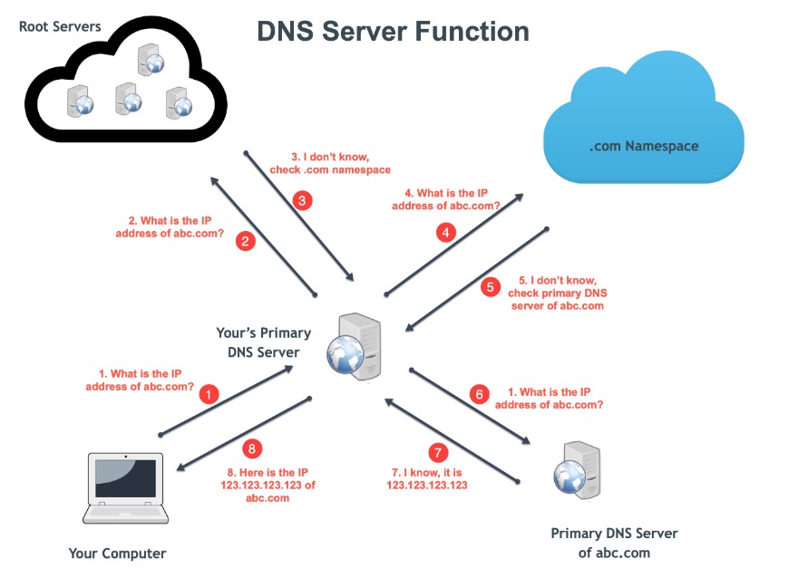

<ul>
  <li>
    <h4>Analisis DNS</h4>
    

      DNS (Domain Name System) adalah sistem yang digunakan dalam jaringan komputer untuk mengonversi nama domain (seperti www.contoh.com) menjadi alamat IP numerik yang digunakan oleh komputer dan perangkat jaringan untuk berkomunikasi satu sama lain. DNS memainkan peran penting dalam memfasilitasi koneksi internet dengan mengartikan nama domain yang mudah diingat menjadi alamat IP yang diperlukan oleh komputer untuk mengidentifikasi tujuan komunikasi.
    

  </li>
  <li>
    <h4>Cara Kerja DNS</h4>
    

Saat Anda memasukkan suatu nama domain (misalnya, www.contoh.com) ke dalam peramban web Anda, peramban akan mengirimkan permintaan resolusi DNS ke server DNS yang ditugaskan oleh penyedia layanan internet Anda. Jika server DNS tersebut memiliki informasi yang diperlukan dalam cache-nya, maka resolusi dapat dilakukan secara langsung tanpa perlu meminta informasi lebih lanjut.

    
2. <b>Iterasi DNS </b>: Jika informasi tidak ada dalam cache server DNS tersebut, server DNS tersebut akan mulai melakukan proses iterasi. Ini melibatkan berkomunikasi dengan berbagai server DNS lain yang bertanggung jawab atas bagian-bagian tertentu dari struktur domain.

    
3. <b>Rekursi DNS </b>: Server DNS yang menerima permintaan resolusi dapat melibatkan proses rekursi. Dalam rekursi, server DNS akan menghubungi server DNS lain dan secara bertahap meminta informasi hingga menemukan server DNS yang memiliki informasi tentang nama domain yang diminta.

    
4. <b>Resolusi Akhir </b>: Setelah server DNS menemukan informasi tentang nama domain, ia akan mengirimkan informasi tersebut kembali ke peramban web atau perangkat yang mengajukan permintaan. Informasi ini termasuk alamat IP yang terkait dengan nama domain yang diminta.

    
5. <b>Penyimpanan Cache </b>: Setelah resolusi berhasil dilakukan, server DNS yang melakukan resolusi dapat menyimpan informasi ini dalam cache-nya. Ini membantu mempercepat resolusi di masa mendatang jika permintaan serupa dilakukan.

    
5. <b>Komunikasi dengan Tujuan </b>: Setelah alamat IP diperoleh melalui resolusi DNS, perangkat Anda dapat menggunakannya untuk menghubungi server yang sesuai dengan nama domain yang diminta. Koneksi tersebut dapat digunakan untuk mengambil halaman web, mengirim email, atau melakukan berbagai bentuk komunikasi lainnya.

  </li>
  <li>
    <h4>Header di DNS Protokol</h4>
    DNS dapat memakai dua layers osi yaitu TCP dan UDP
    
    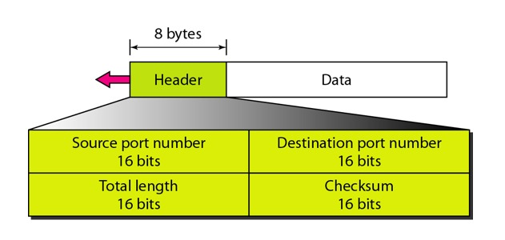
    
Header yang dipakai DNS merupakan dari layers TCP dan juga bisa UDP, berikut ini merupakan contoh header dari DNS yang didapat dari WireShark,

    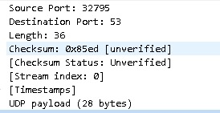
  </li>
  <li>
    <h4>Interaksi DNS</h4>
    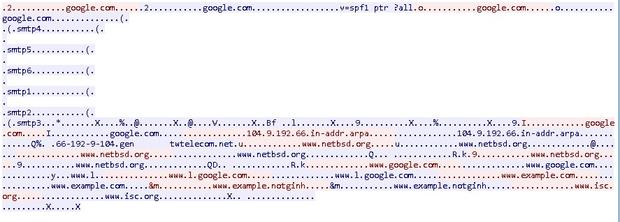
    
Untul tanda merah merupakan interaksi dari klient sedangkan biru merupakan interaksi atau response dari server. DNS berfungsi untuk mengubah atau mengonversi menjadi IP

  </li>
</ul>