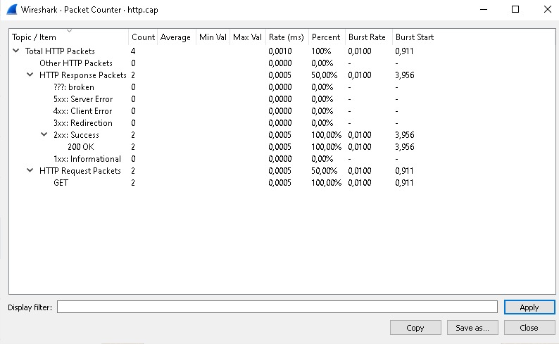

<h1>Analisis Packet Counter HTTP</h1>
 

Nama : Agung Dwi Nugroho

Kelas : 2 D4 IT A

NRP : 3122600006

  Pada hasil packet counter yang ada diatas tersebut dapat kita lihat bahwa ada 4 packet yang terkirim dari interaksi yaitu di HTTP Response dan di HTTP Request

1. Untuk HTTP Response sendiri terjadi dua paket dengan HTTP status 200 OK yang artinya packet terkirim dengan succes tanpa ada error dengan Burst Rate 0,0100 dan Burst Start 3,956

2. Untuk HTTP Request sendiri juga terjadi perpindahan dua paket dengan HTTP method GET dengan Burst Rate 0,0100 dan Burst Start 0,91

Proses ini terjadi dalam 0,0010 ms dengan rincian 0,0005 untuk HTTP Response dan 0,0005 dari HTTP Request

