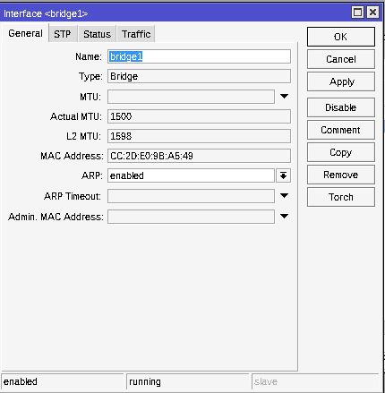
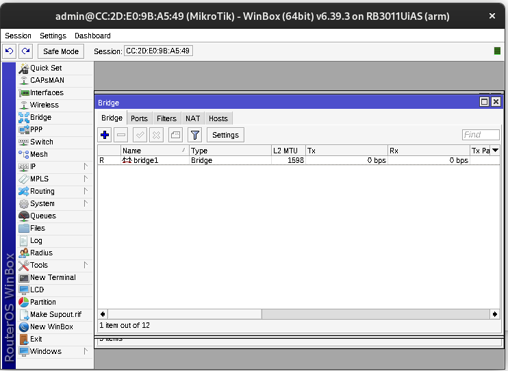
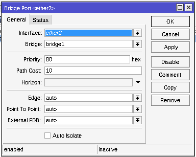
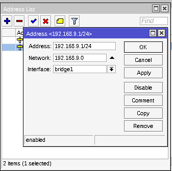
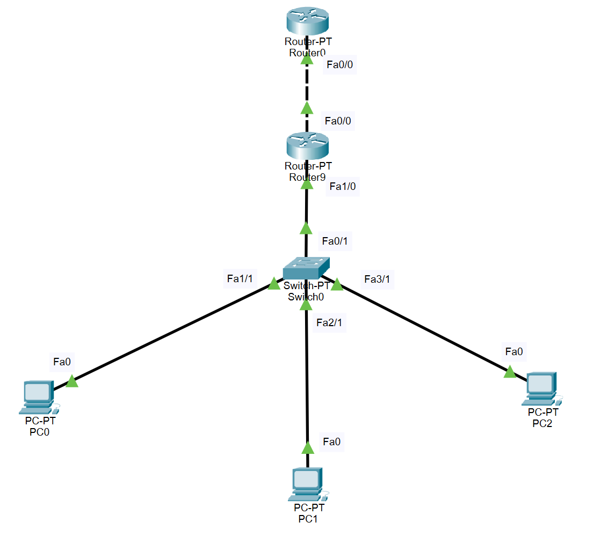

# MIKROTIK WINBOX ROUTING

### Konfigurasi Mikrotik Winbox
 

#### Bridge
---

<i>Gambar: Membuat bridge baru</i>

<i>Gambar: Hasil bridge yang baru saja dibuat</i>

#### Bridge Ports
---

<i>Gambar: Menambahkan ether baru bada bridge ports</i>

<i>Gambar: Hasil ether yang telah ditambahkan pada bridge ports</i>

#### Addresses
---

<i>Gambar: Mengatur IP address pada bridge</i>

<i>Gambar: Mengatur IP address pada ether</i>

#### Routing
---

<i>Gambar: Mengatur routing sehingga dapat terhubung degan router ether yang lainnya</i>

### Physical Model
Ilustrasi physical model koneksi antar komponen jaringan.

#### Konfigurasi 
Konfigurasi tiap komponen jaringan

1. Router 0
-Static
Network     : 192.168.9.0
Mask        : 255.255.255.0
Next Hop    : 10.252.108.19
-Fe 0/0
IPv4 Address: 10.252.108.9
Subnet Mask : 255.0.0.0

2. Router 9
-Fe 0/0
IPv4 Address: 10.252.108.19
Subnet Mask : 255.0.0.0
-Fe 1/0
IPv4 Address: 192.168.9.1
Subnet Mask : 255.255.255.0

3. PC 0
IPv4 Address    : 192.168.9.2
Subnet Mask     : 255.255.255.0
Default Gateway : 192.168.9.1

4. PC 1
IPv4 Address    : 192.168.9.3
Subnet Mask     : 255.255.255.0
Default Gateway : 192.168.9.1

5. PC 2
IPv4 Address    : 192.168.9.4
Subnet Mask     : 255.255.255.0
Default Gateway : 192.168.9.1