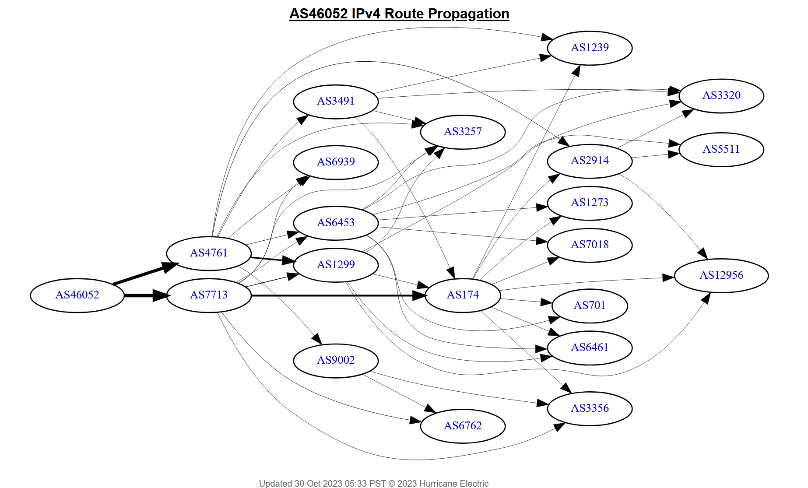
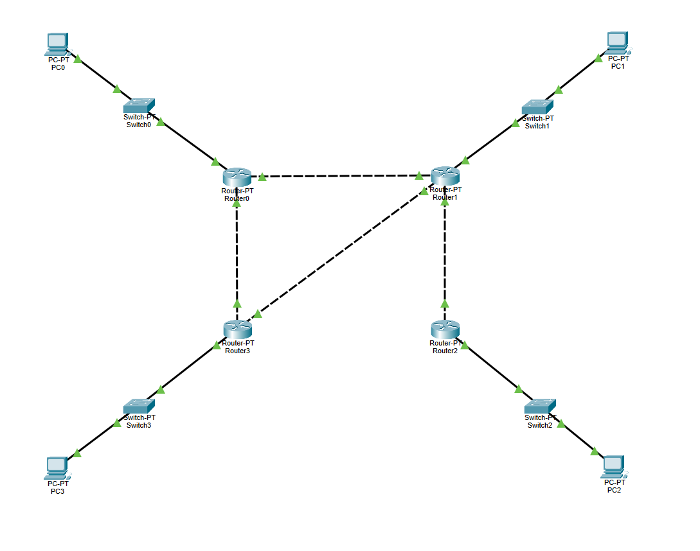

# ROUTING
## Routing Types
Routing dapat dibagi menjdi 2, static dan dynamic. Berikut penjelasnyya:
1. Static:
Metode konfigurasi routing pada static routing bersifat manual, yang mana admin jaringan harus menentukan alur rute satu per satu, dan jika terdapat perubahan, maka juga dilakukan secara manual, menjadikannya tidak adaptif. Routing ini cocok untuk topologi jaringan yang kecil dan relatif tetap/tidak terjadi perubahan. Jenis routing ini memiliki ringkat keamanan yang lebih tinggi daripada routing dynamic.
2. Dynamic:
Pada routing dinamis, digunakan algoritma routing yang complex, dibandingkan dengan routing static. Ketika terdapat perubahan pada topologi jaringa, maka router akan mendapatkan pesan akan hal tersebut, dan akan secara otomatis mengatur ulang rutenya. AKn tetapi, dibandingkan dengan routing static, tingkat keamanannya lebih rendah.

## Router Types
Dalam jaringan komputer, terdapat beberapa jenis router. Diantaranya adalah Edge router dan Core router.
- **Edge Router :** Edge router adalah router yang terletak pada sisi luar dari sebuah jaringan dan dapat menghubungkan antara sebuah jaringan internal dengan jaringan eksternal. Router ini dapat memilah dan mengatur data apa yang dapat diakses oleh jaringan luar.
- **Core Router :** Core router bisasanya terletak pada bagian dalam sebuah jaringan dan berfungsi untuk menghubungkan dan mengatur jaringan-jarinagn yang terdapat dalam sebuah topologi yang besar. Router ini mengatur lalu lintas antara ruter-ruter dalam sebuah jaringan dan mengatur jalur pengiriman yang paling baik untuk kominikasi dalam jarinagn tersebut.

## Routing jaringan PENS
Melalui website https://bgp.he.net/AS46052, anda dapat melihat AS(Autonomous System) dari Politektik Elektronika Negeri Surabaya dan melihat grafik jaringan yang terhubung dengan PENS seperti dibawah ini:

<i>Gambar: Grafik koneksi jaringan PENS dengan jaringan eksterlnal.</i>

Dari gambar grafik diatas, anda dapat melihat jaringan PENS(AS46052) terhubung dnegan INDOSAT Internet Network Provider(AS4761) dan PT Telkom Indonesia(AS7713). Isi dari Autonomous System hanya dapat diakses sepenuhnya oleh administrator jaringan tersebut.

## Percobaan

<i>Gambar: Ilustrasi Topologi Jaringan pada cisco packet tracer.</i>

Pada perc