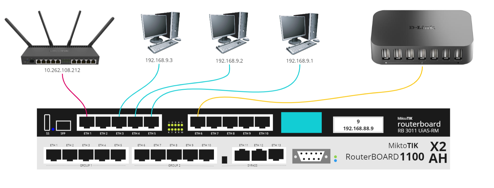

# PING, IP ROUTE, LOGICAL AND PHYSICAL ROUTER MODEL

## Ping antar PC
Melakukan ping antar PC yang terhubung pada satu router yang sama melalui kabel ethernet.

 
<i>Gambar: Hasil ping pada PC dalam satu jaringan.</i>

 
<i>Gambar: Hasil ping pada PC dalam satu jaringan.</i>

 
<i>Gambar: Hasil ping pada PC dalam satu jaringan.</i>

## Physical Model

 
<i>Gambar: Physical model</i>

Pada router board ini, port ETH1 terhubung ke router utama, sementara port ETH3, ETH4, dan ETH5 terhubung secara berurutan ke PC3, PC2, dan PC1. Selain itu, port eth6 terhubung ke sebuah hub. Dengan konfigurasi ini, router board ini dapat menghubungkan router utama dengan tiga komputer (PC1, PC2, dan PC3) melalui port ETH3, ETH4, dan ETH5, serta terhubung ke perangkat lain melalui hub yang terhubung ke port ETH6.

## Logical Model

 
<i>Gambar: Logical model topologi semua router</i>

 
<i>Gambar: Logical model yang mengilustrasikan cara router berhubung dengan PC dan perangkat tamabahan mealuli hub menggunakan kabel.</i>

## Print IP Route
Menampilkan IP route pada raouter menggunakan winbox.

 
<i>Gambar: Hasil print IP route</i>

Pada gambar diatas dapat dilihat rute yang sudah dikonfigurasi pada router melalui aplikasi winbox. Pada gambar diatas, terlihat bahwa sudah dikonfigurasikan rute untuk ether1 saja, dan belum dikonfigurasikan untuk ether yang lainnya. 

Pada saat menggunakan command ip route print pada terminal winbox, terdapat keterengan Flags yang muncul sebagai status dari routing yang ada, diantaranya dalah:
- X: disabled
- A: active
- D: dynamic
- C: connect
- S: static
- r: rip
- b: bgp
- o: ospf
- m: mme
- B: blackhole
- U: unreachable
- P: prohibit

Dapat dilihat bahwa kedua rute yang sudah terkonfigurasi memiliki status **ADC** yang berarti kedua rute tersebut available, bersifat dynamic, dan terhubung.
