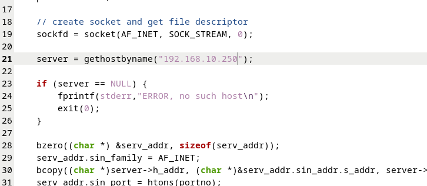
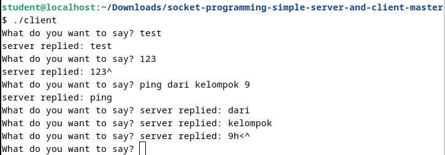
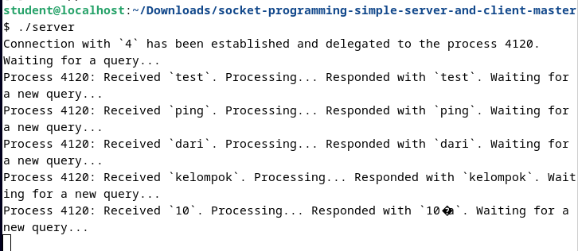

# Aplikasi Chat
Pada percobaan kali ini, kita menggunakan aplikasi chat yang sebelumnya pernah digunakan(simple socket server and client) dan menggunakannya untuk berkomunikasi kepada PC di kelompok lain(di sini antar kelompok 9 dan kelompok 10).

Pada PC yang digunakan, pastikan sudah terhubung dengan LAN dan routingnya sudah terkonfigurasi terlebih dahulu melaui winbox sehingga dapat melakukan ping antar PC pada kelompok yang berbeda.

## Client
Pada file client.c pastikan untuk mengubah alamat IP dari server yang dituju sesuai dengan alamat IP dari PC kelompok lain yang bertindak sebagai server.

 
<i>Gambar: IP yang dituju dirubah menjadi IP PC kelompok 10 yang menjadi server.</i>

 

Setelah itu, simpan perubahan pada client.c dan jadikan file tersebut menjadi excutable file. jalankan file executable client dan tunggu hingga terhubung, pastikan bahwa serevr sudah dijalankan terlebih dahulu. Setelah terhubung, maka anda dapat mengirimkan pesan kepada PC yang bertindak sebagai server.

 

## Server
Jadikan file server.c sebagai executable file dan jalankan, pastikan mengetahui IP anda sehingga PC lain dapat terhubung dengan dengan server ini. Pada file client.c milik kelompok lain, alamat IP tujuan disesuaikan dengan alamat milik IP anda. Setalh itu, tunggu hingga PC milik teman kelompok lain sudah terhubung, dan anda bisa saling berkomunikasi.

