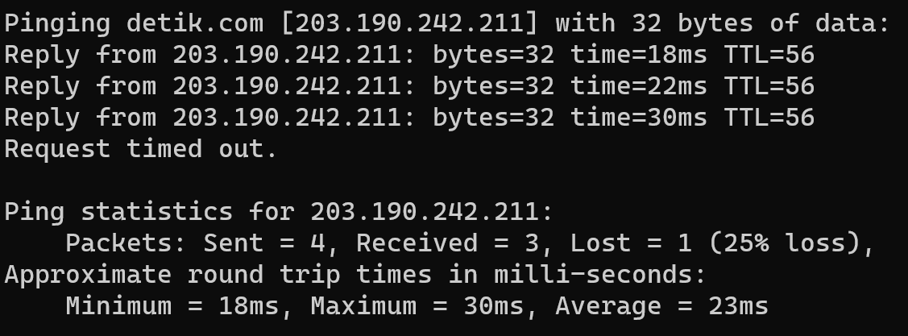

# Ping dan Traceroute

## 1. Penjelasan Ping dan Trceroute
### 1.1 Ping
Ping, berasal dari istilah Packet Internet Network Groper, adalah sebuah perintah atau utilitas yang digunakan dalam jaringan komputer untuk mengukur waktu yang diperlukan untuk mengirimmkan paket data dari satu titik ke titik lain dalam jaringan, juga untuk memastikan ketersediaan atau keberadaan dari host atau server yang dituju, serta untuk melihat kuatilas koneksi internet user berdasarkan hasil respon ping yang diterima. Secara singkat, ping adalah perintah yang berfungsi untuk mengecek status dan keberadaan host dalam sebuah jaringan internet.

Cara kerja ping adalah saat perintah ping dieksekusi, komputer akan mengirim paket ICMP(Internet Control Message Protocol) ke alamat tujuan. Ketika perangkat tujuan menerima paket, ia akan mengirimkannya kembali ke pengirim awal. Dari situ komputer pengirim akan mengukur waktu yang dibutuhkan untuk paket data pergi dan kembali yang disebut RTT(Round Trip Time).

Bagian-bagian yang ditunjukkan oleh respon ping adalah:
- **Nama, Alamat Server dan Ukuran Packet:** pada bris pertama dari respon ping, akan ditunjukkan nama dari server tujuan diikuti dengan alamat IP-nya, dan juga ukuran packet yang dikirimkan ke tujuan.
- **Balasan dari Tujuan:** Setiap baris di bawahnya menunjukkan setiap balasan dari tujuan dengan keterangan ukuran paket yang diterima balik, Round Trip Time, dan Time To Live-nya(batas lompatan antar router untuk menerima paket, digunakan agar paket tidak berputar di jaringan selamanya).
- **Packet Loss Statistics:** menunjukkan jumlah paket yang dikirimkan oleh komputer ke alamat tujuan dan jumlah paket yang diterima kembali serta jumlah paket yang tidak diterima kembali. Pada umumnya, ping mengirimkan 4 buah paket, kemudian menghitung packet loss yang terjadi yaitu paket yang tidak diterima per paket total dalam bentuk persentase.
- **RTT Statistics:** menujukkan rangkuman dari RTT yang ada berupa minimum, maksimum, dan rata-rata.

### 1.2 Traceroute
Traceroute digunakan untuk mengetahui rute yang dilewati suatu paket dari sumber hingga mencapai tujuan. Perintah tracert digunakan untuk melakukan traceroute mealalui cmd secara real time. Ini membantu mengidentifikasi semua perangkat jaringan (router atau hop) yang dilewati oleh paket data saat melakukan perjalanan dari sumber ke tujuan.

Cara kerja dari traceroute adalah pada saat perintah tracert dieksekusi dengan menentukan alamat tujuan, komputer yang digunakan akan mengirim serangkaian paket data dengan TTL(Time to Live) yang semakin besar. TTL ini diatuur untuk mencegah paket tetap berputar di jaringan selamanya. Saat paket mencapai router atau hop dalam perjalanan, TTL dikurangi sebangak satu satuan. Setiap router atau hop yang menerimapaket dengan TTL habis akan merespon dengan mengirimkan pesan TTL expired. Dari situ komputer pengirim mengumpulkan respon dari setiap hop dan mengidentifikasi hop yang dilewati oleh paket data saat perjalanan dari sumber ke tujuan.

Pada kasus tertentu, dapat terjadi suatu masalah saat melakukan hop, dimana pada hasil traroute akan menunjukkan pesan error. Terdapat tiga macam eror yang sering ditemui yaitu requst timed out-biasanya terjadi karena masalah jaringan, asterik di kolom RTT-menandakan kegagalan mengembalikan respon dalam waktu yang diberikan, dan destination net unreachable-dimana memberitahukan kegagalan dalam menemukan rute menuju alamat tujuan sehingga berhenti bregerak.

Bagian-bagian yang ditunjukkan oleh respon traceroute adalah:
- **Nama dan Alamat Server:** dituliskan pada baris pertama yang menunjukkan nama dan alamat IP dari server tujuan.
- **Nomor Hop:** yang menandakan hop keberapa yang dilewati pada baris tersebut. Setiap hop menandakan router atau perangkat jaringan yang dilewati untuk mencapai tujuan, yakni detik.com.
- **RTT(Round Trip Time):** Merepresentasikan waktu yang dibutuhkan untuk setiap paket untuk mencapai sebuah alamat IP dan mengembalikannya ke komputer pengguna. Secara deafult traceroute mengirimkan tiga paket sehingga RTT juga berjumlah tiga.
- **IP/Host:** menunjukkan alamat IP atau nama host yang dilewati pada hop tersebut.

## 2. Percobaan Ping dan Traceroute
### 2.1 Ping
  

<i>Gambar: Hasil penggunaan perintah ping</i>

 

- Perangkat mengirimkan 4 paket ping ke www.detik.com yang memiliki IP 203.190.242.211
- Hasil ping menunjukkan bahwa hanya 3 dari 4 paket yang dikirimkan diterima kembali, menjadikannya 25% loss.
- RTT paket ping memiliki waktu terpendek 18ms dan waktu terpanjang 30ms dengan rata-rata RTT paket terkirim adalah 23ms.
- TTL(Time To Live) yang bernilai 56, menandakan batas hop/pergerakan paket untuk mencapai ke tujuan.

### 2.2 Traceroute

<i>Gambar: Hasil penggunaan perintah traceroute</i>

 

Dapat dilihat bahwa dilakukan 6 hop untuk mencapai tujuan detik.com, dengan keterangan berikut:
- Hop 1: Paket mencapai gateway atau router lokal, yang memiliki IP privat(192.168.0.1)
- Hop 2: Paket masih melewati sebuah jaringan dengan IP lokal(192.168.18.1)
- Hop 3: Setelah itu, paket melewati jaringan ISP(10.109.0.1)
- Hop 4: Kemudian, paket meninggalkan jaringan lokal dan berinteraksi dengan perangkat di luar jaringan, ditandakan dengan alamat IP eksternal(117.102.79.237)
- Hop 5: Setelahnya, terjadi hop eksternal lagi(182.253.187.141)
- Hop 6: Terjadi *Requaest Timed Out* yang mana pada hop tersebut tidak merespon kembali pada request traceroute. Hal ini dapat disebabkan oleh masalah jaringan atau konfigurasi keamanan.
- Hop 7: Tracert berlanjut kembali setelah request timed out
- Hop 8: Pada hop terakhir, paket telah mencapai server detik.com itu sendiri(s211-cast-211-221-49-103.detik.com [103.49.221.211]). yang mana RTT pada hop ini menujukkan latensi antara komputer yang digunakan dengan server yang dituju.
