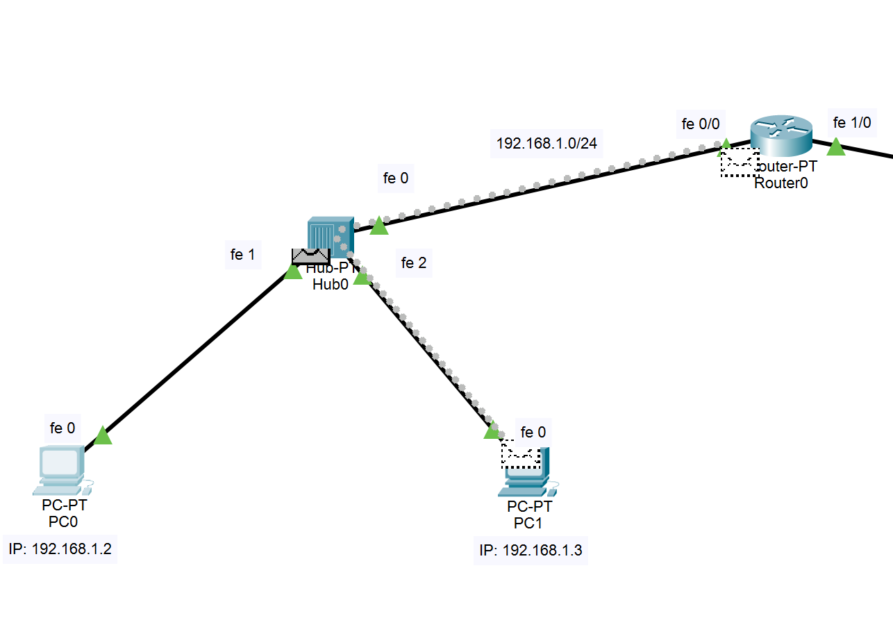

# 1 Router Network Configuration
## 1 Router, 2 Switch, 4 PC
### Konfigurasi
Pada percobaan konfigurasi jaringan menggunakan 1 router, pertama digunakan sebuah router tipe router-pt dengan 2 switch tipe 2960 dan 4 pc tipe pc-pt. dengan topologii sebagai berikut

<i>Gambar: Topologi penataan jaringan</i>

Pada jaringan tersebut, kita atur konfigurasinya sebagai berikut:
- menghubungkan setiap komponennya menggunakan straight cable dengan fasEthernet,
- mengatur IP sesuai dengan yang tertera di gambar atas,
- mengatur default gateway dari PC0 dan PC1 sebagai 192.168.1.1, dan
- mengatur default gateway dari PC2 dan PC3 sebagai 192.168.6.1 .
Pastikan bahwa kedua fastEthernet pada router telah dinyalakan terlebih dahulu.

### Skenario
Untuk melihat proses dari skenario perlangkahnya, nyalakan simulasi pada cisco packet tracer. Di sini kita menjalankan semua skenarionya melalui command prompt milik PC0.

#### 1. Skenario 1: ping 192.168.1.3 untuk pertama kalinya
Pada saat awal menjalankan simulasi, ketika dilakukan ping dari PC0 menuju PC1(keduanya terhubung pada switch yang sama), jika perangkat yang melakukan ping belim pernah mengenal MAC address dari perangkat yang dituju, maka akan dilakukan broadcast terlebih dahulu. Dalam simulasi, broadcast ini dapat dilihat dimana saat awal proses ping, PC0 mengirim sebuah packet yang kemudian oleh switch didistribusikan kepada seluruh perangakat yang terhubung dengannya. Hal ini dialkukan untuk mengidentifikasi letak dari perangkat yang hendak dituju. Setelah itu, packet tersebut akan dikembalikan oleh perangkat yang sesuai. Setelah proses ini, barulah PC0 memulai proses untuk mengirimkan packet ping kepada PC1 yang dituju.

<i>Gambar: Hasil ping pada skenario pertama</i>

Oleh karena itu, dapat dilihat pada gambar diatas, bahwa reply pertama memakan waktu 8ms dibandingkan dengan reply lainnya yang hanya membutuhkan 4ms. Hal ini dikarenakan proses pencarian MAC address dari alamat tujuan.

#### 2. Skenario 2: ping 192.168.1.3 ulang
Ketika dilakukan ping lagi dari PC0 ke PC1, karena PC0 sudah mengenal MAC address dari PC1, proses ping berjalan dengan lebih cepat karena tidak dilakukan broadcast terlebih dahulu dan PC0 langsung mengirimkan packet ping ke PC1. Hal ini dapat dilihat pada gambar di bawah dimana pada proses ping dari skenario kedua memiliki wkatu reply yang sama pendek yaitu 4ms, berbeda dengan skenario pertama yang mana reply pertama ping memakan waktu 8ms.

<i>Gambar: Hasil ping pada skenario kedua</i>

#### 3. Skenario 3: ping 192.168.6.2 untuk pertama kalinya
Pada Skenario ketiga, kita lakukan ping dari PC0 ke PC2, yakni PC yang memiliki satu router yang sama akan tetapi terhubung pada subnet/switch yang berbeda. Pada saat melakukan ping untuk pertama kalinya pada PC yang terdapat pada subnet yang berbeda, akan dilakukan proses pencarian MAC address yang serupa dengan yang terjadi  pada skenario 1. Akan tetapi, karena waktu pencarian MAC address pada subnet yang berbeda memakan waktu lebih lama, maka akan terjadi sebuah RTO(Request Timed Out) pada reply pertamanya. Akan tetapi, jika MAC address-nya sudah ditemukan, paket akan terkirim dan kembali dengan normal.

<i>Gambar: Hasil ping pada skenario ketiga</i>

Jika anda perhatikan pada gambar diatas, waktu yang dibutuhkan untuk mengirim paket ping dan menerima kembali balasannya antara kedua PC ini memakan waktu yang lebih lama dibandingkan prosesnya pada skenario 1 dan 2 yang mana kedua PC yang berkomunikasi berada pada subnet yang sama.

#### 4. Skenario 4: ping 192.168.6.2 ulang
Karena MAC address dari PC2 yang dituju sudah diketahui, PC0 dapat langsung mengirimkan packet ping dan menerimanya kembali tanpa terjadi RTO, sehingga pada skenario keempat ini tidak terjadi RTO sama sekali. Keempat packet ping terkirim dan kembali dalam waktu 8ms.

<i>Gambar: Hasil ping pada skenario keempat</i>

## 1 Router, 2 Hub, 4 PC
### Konfigurasi
Pada percobaan yang ini, kita menggunakan toplogi jaringan dan konfigurasi yang sama dengan percobaan pertama, hanya saja menggantikan switch dengan hub. ini kita lakukan agar kita dapat mengetahui perbedaan perilaku antara hub dengan switch.

<i>Gambar: Topologi penataan jaringan</i>

### Skenario
#### 1. Skenario 1: ping 192.168.1.3 untuk pertama kalinya

<i>Gambar: Hasil ping pada skenario pertama</i>

Dapat dilihat bahwa komunikasi antar perangkat dalam satu subnet yang sama menggunakan hub memiliki hasil ping yang sama dengan pada saat penggunaan switch, yang mana reply pertama menghabiskan waktu yang lebih panjan untuk mencari MAC address dari PC yang dituju terlebih dahulu, dilanjutkan dengan reply dengan waktu yang lebih singkat. akan tetapi perbedaan yang terjadi adalah pada proses pengiriman paketnya, yakni selalu dilakukannya broadcast walaupun sudah diketahui MAC address dari PC yang dituju. Bahkan saat PC1 yang menjadi tujuan ping membalas, PC1 juga melakukan broadcast saat mengirimkannya.

<i>Gambar: Pada pengiriman packet kedua hingga keempat, tetap dilakukan broadcast walau lokasi PC1 sudah diketahui.</i>

<i>Gambar: Pada pengiriman reply oleh PC1, juga dilakukan broadcast</i>

#### 2. Skenario 2: ping 192.168.1.3 ulang

<i>Gambar: Hasil ping pada skenario kedua</i>

Pada saat melakukan ping untuk kedua kalinya pada percobaan menggunakan hub, yang terjadi adalah, walaupun komputer yang melakukan ping sudah mengetahui MAC address dari PC1 yang dituju, saat packet menuju hub, akan tetap dilakukan broadcast, mengirimkan packet ping tersebut ke semua perangkat yang terhubung oleh hub tersebut. Begitu juga pada saat PC1 mengim kembali reply menuju PC0, akan tetap dilakukan broadcast saat reply packet tersebut telah mencapai hub.

<i>Gambar: Pada pengiriman packet kedua hingga keempat, tetap dilakukan broadcast walau lokasi PC1 sudah diketahui.</i>

<i>Gambar: Pada pengiriman reply oleh PC1, juga dilakukan broadcast</i>

#### 3. Skenario 3: ping 192.168.6.2 untuk pertama kalinya

<i>Gambar: Hasil ping pada skenario ketiga</i>

Pada saat PC0 mencoba untuk mengirim ping pada PC2 yang terletak pada subnet yangg berbeda, seperti pada penggunaan switch di awal percobaan, PC0 akan pertama berusaha untuk mencari MAC address dari PC2. Akan tetapi karena PC2 terletak pada subnet yang berbeda, proses ini memakan waktu yang lama sehingga terjadi Request Timed Out pad reply pertamanya. Pada proses pengiriman ping packet, PC0 pertama mengirim packet ke hub, yang kemudian oleh hub dikirimkan sebagai Broadcast. Saat telah mencapai router, router akan mengirimkan pada Hub1, yang kemudian melakukan Broadcast ke semua perangkat yang terhubung padanya, walaupun MAC address dari PC2 sudah diketahui. Begitu juga saat mengirimkan reply, ketika packet dari PC2 mencapai Hub1, Hub1 akan melakukan broadcast, walaupun letak PC0 sudah diketahui dengan tepat.

<i>Gambar: Hub1 akan tetap melakukan broadcast walaupun MAC address dari PC2 telah diketahui.</i>

<i>Gambar: Pada pengiriman reply, Hub1 juga tetap melakukan broadcast</i>

#### 4. Skenario 4: ping 192.168.6.2 ulang

<i>Gambar: Hasil ping pada skenario keempat</i>

Pada skenario terakhir, dapat dilihat bahwa tidak terjadi Request Timed Out karena MAC address dari PC2 yang dituju sudah diketahui. AKan tetapi, pada proses pengiriman packet ping oleh PC0 menuju PC2 dan pengiriman balasan oleh PC2 menuju PC0 selalu dilakukan Broadcast oleh Hub(baik Hub0 maupun Hub1) setiap kalai melewatinya.
