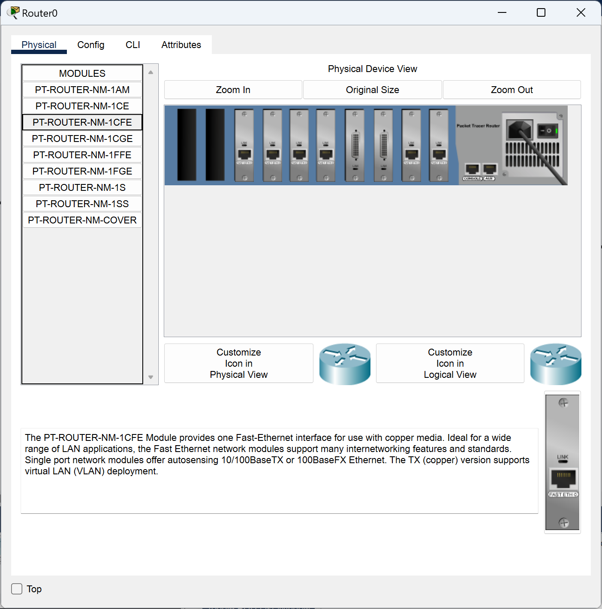
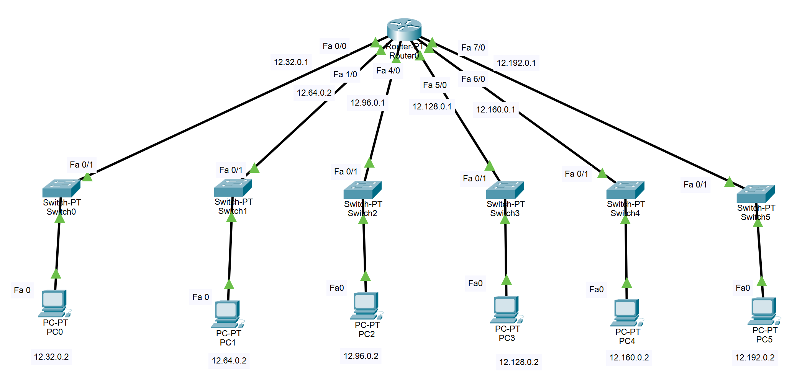
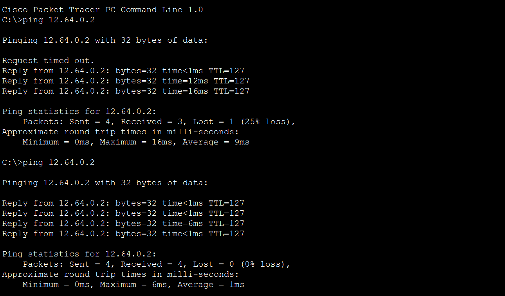
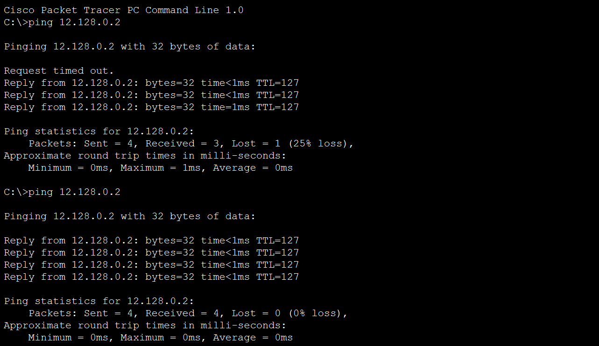
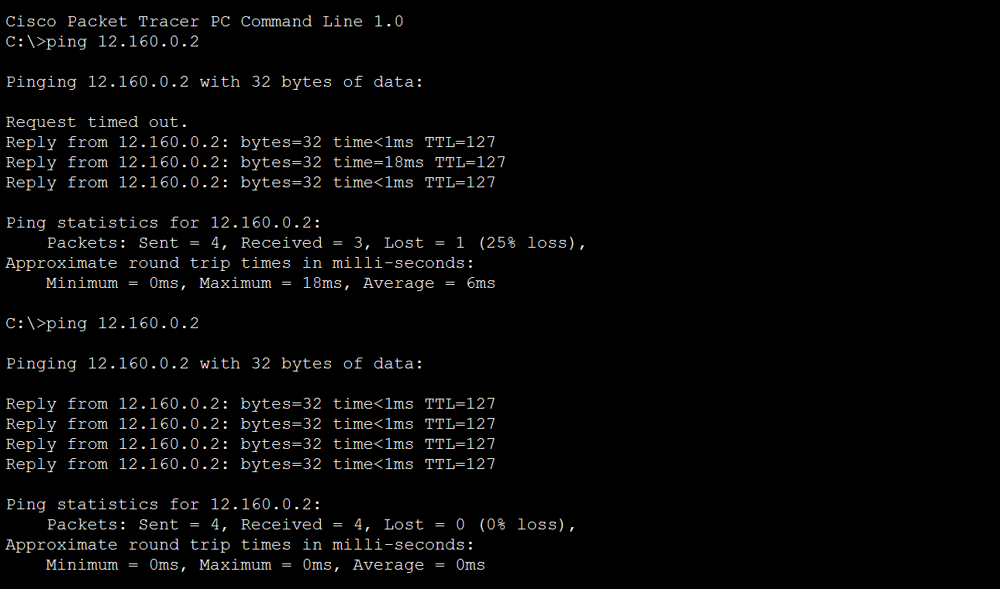
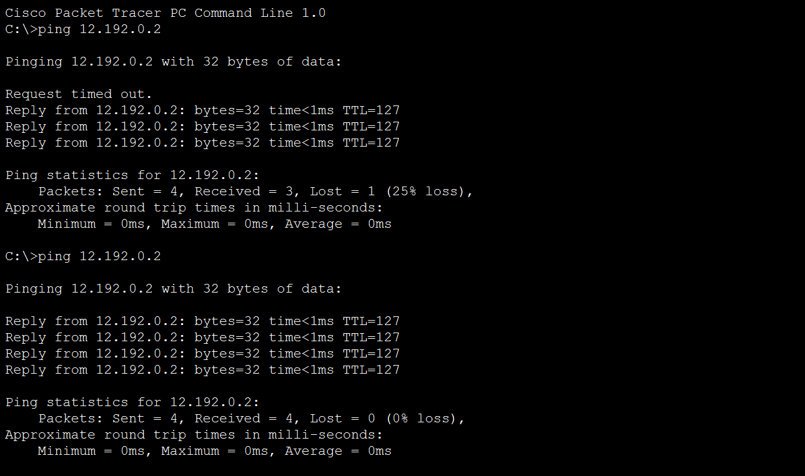

# Subnetting
Pada percobaan kali ini, kita melalkukan subnetting pada IP 12.0.0.0/8 menjadi 6 subnet.

PAda umumnya, sebuah router tipe PT hanya memiliki 2 socket FastEthernet tipe CFE, sedangkan, untuk percobaan ini kita membutuhkan 6. Untuk itu, klik dua kali pada router agar dapat mengakses pengaturan physicalnya. Tekan power switchnya terlebih dahulu agar dapat menambahkan socket. Kemudian, pilih PT-ROUTER-NM-1CFE dan tambahkan pada router dengan cara drag and drop. Setelah berjumlah 6, nyalakan kembali router dengan menekan tombol power switch. Proses menyalakan ulang dapat memakan waktu yang sedikit lama.

<i>Gambar: menambah jumlah FastEthernet tipe CFE menjadi 6</i>

Setelah itu, buat jaringan seperti di bawah menggunakan 6 buah Switch-PT dengan masing-masing 1 PC tipe PC-PT pada setiap switch-nya. Hubungkan semua kombonen jaringan menggunakan straight cable dengan keterangan seperti di bawah.

<i>Gambar: Topologi jaringan dengan 6 subnet</i>

Pada setiap kabel yang terhubung pada router, kita atur konfigurasi IPv4-nya sebagai berikut:
- Fa 0/0 : 12.32.0.1
- Fa 1/0 : 12.64.0.1
- Fa 4/0 : 12.96.0.1
- Fa 5/0 : 12.128.0.1
- Fa 6/0 : 12.160.0.1
- Fa 7/0 : 12.192.0.1

Ubah pula subnet mask masing-masing FastEthernet menjadi 255.224.0.0, bukan default 255.0.0.0. Jangan lupa untuk menyalakan setiap FastEthernetnya agar dapat terhubung setiap subnetnya.

Kemudian, pada setiap PC, kita atur konfigurasinya sehingga memiliki IPv4 sebagai berikut:
- PC0 : 12.32.0.2
- PC1 : 12.64.0.2
- PC2 : 12.96.0.2
- PC3 : 12.128.0.2
- PC4 : 12.160.0.2
- PC5 : 12.192.0.2

Jangan lupa untuk mengubah subnet masknya dari default 255.0.0.0 menjadi 255.224.0.0. Setelah itu, atur default gateway pada setiap PC pada config->settings menjadi sebagai berikut:
- PC0 : 12.32.0.1
- PC1 : 12.64.0.1
- PC2 : 12.96.0.1
- PC3 : 12.128.0.1
- PC4 : 12.160.0.1
- PC5 : 12.192.0.1

Setelah semua komponen terhubung dan terkonfigurasi, tunggu hingga semua seditiga dan linkaran pada setiap kabel berubah menjadi segitiga berwarna hijau.

### Ping Test
Setelah melakukan subnetting dan mengkonfigurasi setiap subnetnya dengan benar, kita dapat melakukan ping antara setiap PC seperti di bawah.

<i>Gambar: Hasil ping dari PC0(12.32.0.2) ke PC1(12.64.0.2)</i>

Seperti pada percobaan sebelumnya, ketika melakukan ping pada PC yang terletak pada subnet yang berbeda akan terjadi RTO pada reply pertanmanya karena PC ynag melakukan ping masih mencari MAC address dari PC tujuan, yang karena terletak pada subnet yang berbeda, akan memakan waktu yang lama, sehingga terjadi RTO. Hal ini juga terjadi pada contoh ping lainnya di bawah.

<i>Gambar: Hasil ping dari PC1(12.64.0.2) ke PC2(12.96.0.2)</i>

<i>Gambar: Hasil ping dari PC2(12.96.0.2) ke PC3(12.128.0.2) </i>

<i>Gambar: Hasil ping PC3(12.128.0.2) ke PC4(12.160.0.2) </i>

<i>Gambar: Hasil ping dari PC4(12.160.0.2) ke PC5(12.192.0.2) </i>

