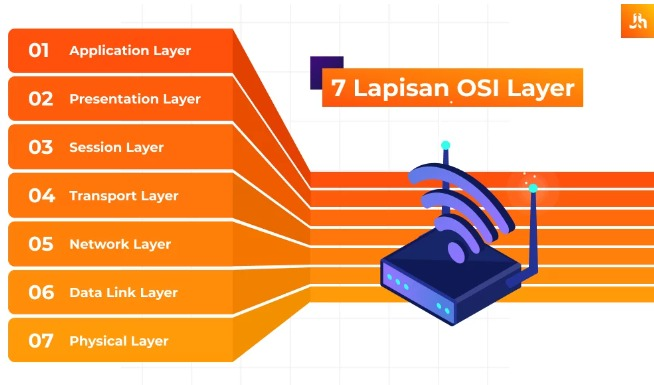

<h1>Pengenalan Internet Layers OSI</h1>
 

Nama : Agung Dwi Nugroho

Kelas : 2 D4 IT A

NRP : 3122600006

 

  

OSI adalah Open System Interconnection yang memiliki arti sebagai model referensi dari sebuah kerangka yang bersifat konseptual. Namun, sekarang sudah berkembang dan menjadi sebuah standarisasi khusus yang berkaitan dengan koneksi komputer. 

 

OSI Layers dibagi menjadi 7 layer seperti

<ul>
  <li>Application Layers</li>
  <li>Presentation Layers</li>
  <li>Session Layers</li>
  <li>Transport Layers</li>
  <li>Network Layers</li>
  <li>Data Link Layers</li>
  <li>Physical Layers</li>
</ul>

  

<ul>
  <li>
    Application Layers
    

      Application layer pada OSI adalah pusat terjadinya suatu interaksi antara user dengan aplikasi yang bekerja menggunakan fungsionalitas sebuah jaringan. Lapisan ini menjadi layer paling atas dari model OSI. Contoh beberapa protokol yang ada di layer application pada OSI adalah HTTP, FTP, SMTP, dan lain-lain. 
    

  </li>
  <li>
    Presentation Layers
    

      Lapisan Presentation berfungsi untuk mengidentifikasi sintaks yang di pakai suatu host jaringan untuk berkomunikasi. Layer ini perlu memberi enkripsi serta deskripsi data yang nantinya akan di pakai dalam layer application.
       
      Pada layer presentation, data akan ter-enkripsi dan dekripsi otomatis melalui sistem. Beberapa protokol yang berada pada layer ini adalah MIME, TLS, SSL, dan lainnya. 
    

  </li>
</ul>
