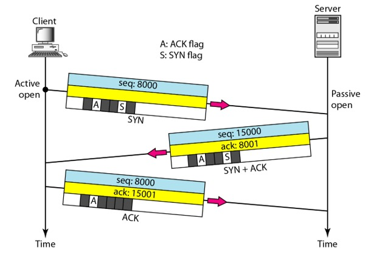

<h1>Kenapa FTP memakai UDP dan TCP, serta Three Way Handshaking</h1>
 

Nama : Agung Dwi Nugroho

Kelas : 2 D4 IT A

NRP : 3122600006

 
<h2>Kenapa Protokol FTP menggunakan UDP dan TCP</h2>
<ul>
  <li>
    <h3>Apa itu FTP ?</h3>
    

      <b>FTP (File Transfer Protocol)</b> adalah internet service yang dirancang untuk membuat sambungan ke server internet tertentu atau komputer, sehingga user dapat mengirimkan file ke komputer (download) atau mengirimkan file ke server (upload).
    

  </li>
  <li>
    <h3>Layers apa yang dipakai FTP</h3>
    

      Meskipun FTP biasanya menggunakan TCP untuk mentransfer data, ada beberapa implementasi alternatif dari FTP yang menggunakan UDP. Namun, penggunaan UDP dalam konteks FTP lebih kompleks dan biasanya dilakukan dengan menggabungkan mekanisme tambahan, seperti pengiriman ulang data khusus, verifikasi checksum, dan manajemen aliran sendiri. UDP lebih cocok untuk aplikasi yang mengutamakan kecepatan dan dapat mentolerir kehilangan data dalam beberapa situasi, seperti streaming video atau audio secara real-time. 
    

    

      Dalam beberapa kasus, protokol yang disebut "FTP" dengan UDP dapat digunakan untuk tujuan transfer yang lebih cepat, tetapi dengan risiko kehilangan data atau tanpa mekanisme yang kuat untuk memastikan keutuhan data. Oleh karena itu, pemilihan antara TCP dan UDP tergantung pada kebutuhan khusus aplikasi dan pentingnya kehandalan dan integritas data dalam transfer.
    

  </li>
</ul>

 
<h2>Penjelasan Three Way HandShaking</h2>

<ul>
  <li>
    <h3>Apa itu Three Way HandShaking?</h3>
    

      Jabat tangan tiga arah adalah metode yang digunakan dalam jaringan TCP/IP untuk membuat koneksi antara host/klien dan server lokal.
    

  </li>
  <li>
    <h3>Penjelasan Three Way HandShaking</h3>
    

      Misalnya, ini mendukung komunikasi antara browser web di sisi klien dan server setiap kali pengguna menavigasi internet.
      Segera setelah klien meminta sesi komunikasi dengan server, proses jabat tangan tiga arah memulai lalu lintas TCP dengan mengikuti tiga langkah.
    

    <ul>
      <li>
      Langkah 1: <b>Koneksi antara server dan klien dibuat</b>
      

          Pertama, koneksi antara server dan klien dibuat, sehingga server target harus memiliki port terbuka yang dapat menerima dan memulai koneksi baru.
          Node klien mengirimkan paket data syn (sinkronisasi nomor urutan) melalui jaringan IP ke server pada jaringan yang sama atau eksternal.
          Paket syn ini adalah nomor urutan acak yang ingin digunakan klien untuk komunikasi (misalnya, x).
          Tujuan dari paket ini adalah untuk bertanya/menyimpulkan apakah server terbuka untuk koneksi baru.
        

      </li>
      <li>
        Langkah 2: <b>Server menerima paket syn dari node klien</b>
        

          Ketika server menerima paket SYN dari node klien, ia merespons dan mengembalikan tanda terima konfirmasi – paket ACK (Nomor Urutan Ucapan Terima Kasih) atau paket SYN/ACK. Paket ini mencakup dua nomor urutan.Yang pertama adalah ACK One, yang ditetapkan oleh server ke satu lebih dari nomor urutan yang diterima dari klien (mis.X+1). Yang kedua adalah syn yang dikirim oleh server, yang merupakan nomor urutan acak lainnya (misalnya, y). Urutan ini menunjukkan bahwa server dengan benar mengakui paket klien, dan itu mengirimnya sendiri untuk diakui juga.
        

      </li>
      <li>
        Langkah 3: <b>Node Klien Menerima Syn/ACK dari server dan merespons dengan paket ACK</b>
        

          Node klien menerima syn/ack dari server dan merespons dengan paket ACK.Sekali lagi, masing -masing pihak harus mengakui nomor urutan yang diterima dengan bertambah satu.
        

      </li>
    </ul>
  </li>
</ul>